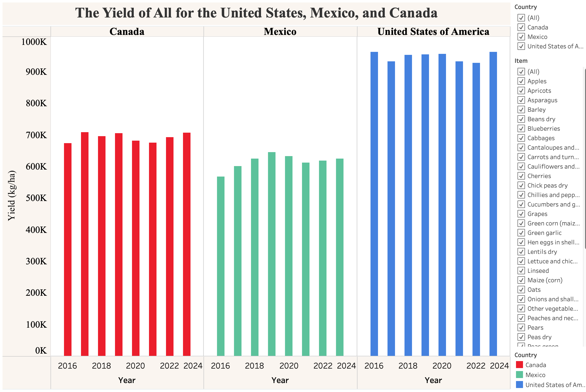

# Food-and-Agriculture-Exploratory-Analysis

## Table of Contents
- [Executive Summary](#Executive-Summary)
- [Project Background](#Project-Background)
- [Trends in Emissions and Changes in Land Temperatures](#Trends-in-Emissions-and-Changes-in-Land-Temperatures)
- [Trend in Total Agricultural Yield](#Trend-In-Total-Agricultural-Yield)
- [Explanation of Differences in Product Pricing](#Recommendations)
- [Acknowledgements](#Acknowledgements)

## Executive Summary
This report provides an exploratory analysis of the effects of greenhouse emissions, land temperatures, agricultural yields, producer pricing, and affordability. The objective of this report is to identify trends representative of the sustainability of modern agricultural practices and to provide context for environmental and economic trends for Mexico, Canada, and the United States.

This report analyzes emission data, temperature data, producer pricing, and rates of unaffordability from 2016 to 2023. The accompanying Tableau dashboards provide an interactive comparison for different categories of foods and emissions across the studied countries.

### Key Findings

* **Land Temperatures:** Changes in land temperatures have seen a stark increase and are expected to continue rising for Canada and Mexico; currently, the increase for Canada is approximately 1 °C higher than that of the United States and Mexico.
* **Total Emissions:** The United States has the highest median emissions (approximately 400 kt higher than that of Canada and Mexico). U.S. emissions decreased to 38% of its value from 2021 to 2023. The emissions for Canada have shown a recent rise, while those of Mexico have seen a minimal decrease.
* **Agricultural Yields:** Overall, there is minimally observed variance in the agricultural yield, though some sources (i.e. green corn, potatoes) have shown gradual increases in yields.
* **Emission Intensity:** Emission intensity is on a slight decline, but has generally remained constant; the exception to this are, "Cereals excluding rise", which had a 75% dropoff in value.
* **Affordability of a Healthy Diet:** Affordability of a healthy diet has declined for Mexico and the United States (more so by the latter); Canada experienced minimal increases.
* **Producer Prices:** The producer prices of Mexico heavily outweigh those of the United States and Canada combined across all agricultural products. Green coffee from the United States is the exception, with a higher producer price than that of Mexico by 36,000 units of standard local currency.
*  **Inflation in Food Pricing:** From 2016 to 2022, inflation continued to increase, but began declining thereafter in the United States by as much as 52%.

Overall, agricultural yields for multiple products have remained at constant levels and even shown to increase for some products. The analysis performed did not demonstrate a sensitivity or a strong connection between rising emissions and increases in temperatures to changes in agricultural yield. In contrast, the costs of food and producer pricing have increased, likely as a result of influence from economic policies and market conditions.

## Project Background
This project used data from the Food and Agriculture Organization of the United Nations's publically available datasets, which provide standardized economic data and agricultural/environmental indicators. This project focuses specifically on data for Canada, Mexico, and the United States. The project made use of Excel, Tableau, and MySQL to prepare and visualize the provided data.

## Trends in Emissions and Changes in Land Temperatures

## Trend in Total Agricultural Yield

Agricultural yield has remained at consistent levels despite increases in changes in land temperature and total emissions. The release of greenhouse gases, the rises in global temperature, and the consequent effects this process has had on the environment is more nuanced and outside of the scope of this project.

The NASA article, "*Rising Carbon Dioxide Levels Will Help and Hurt Crops*" explores how the increases in the concentration of Carbon Dioxide in the atmosphere can have the effect of mitigating yield losses while also increasing water use efficiency through the increase in the rate in photosynthesis under certain conditions; this effect, however, does not overshadow any negative effects caused by increased Carbon Dioxide emissions.

In this dataset, yields displayed a low sensitivity with total emissions and rising land temperatures. The behavior of each of the mentioned quantities is likely to be a sum of other factors not included or portrayed by the data being used, such as increases in the quality of the soil being used, or advancements in irrigation, farming practices, and technology.

## Explanation of Differences in Product Pricing
Product prices for Mexico far exceed those of its northern neighbors. Not only that, but product pricing has continued to increase across all products. This result is due to a variety of factors: 
* Mexico imports materials like fertilizers and pesticides, both of which have a high cost because of the war between Russia and Ukraine
* Disruptions in the supply chain caused by COVID-19 impacted the cost of products
*  Mexican producers often receive higher prices because of export demand and high labor costs
*  In a few regions, producers report extortion from organized crime groups, adding to operational costs.

## Acknowledgements
I would like to thank the Food and Agriculture Organization of the United Nations for their provision of the data that made this project possible.

