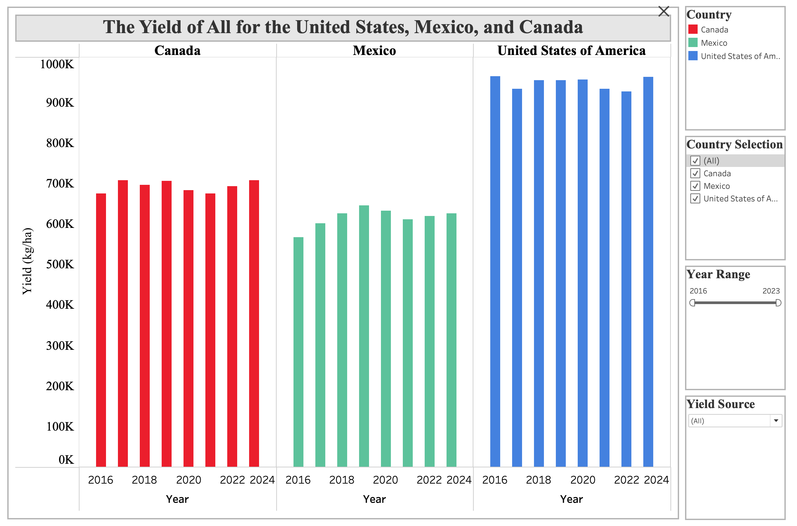
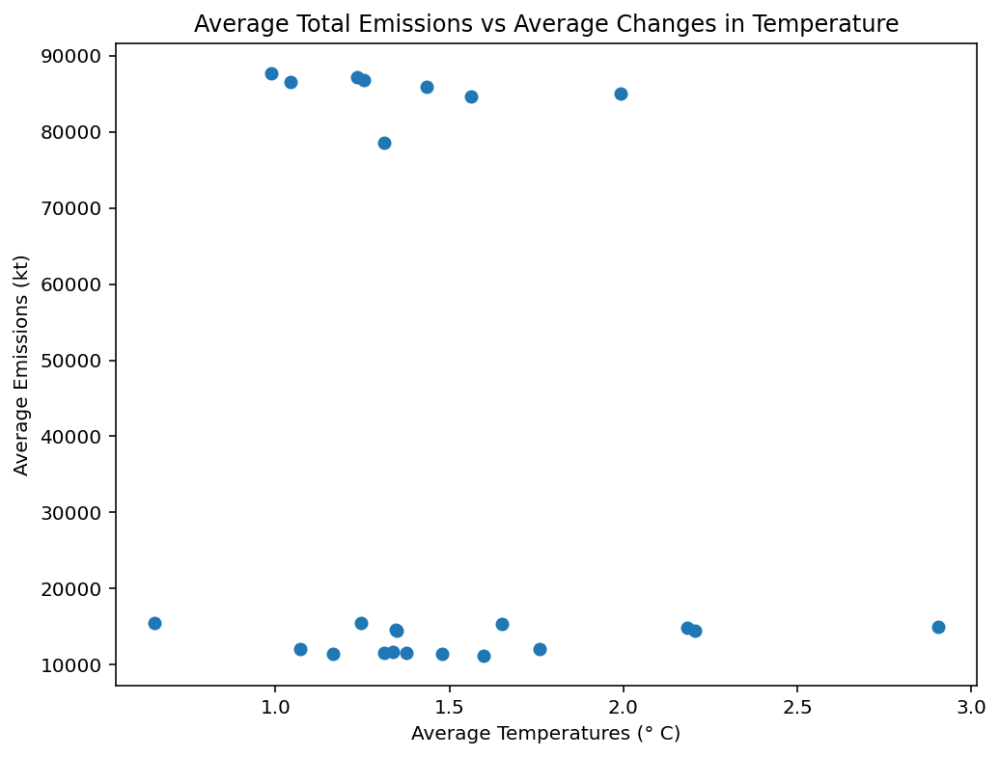
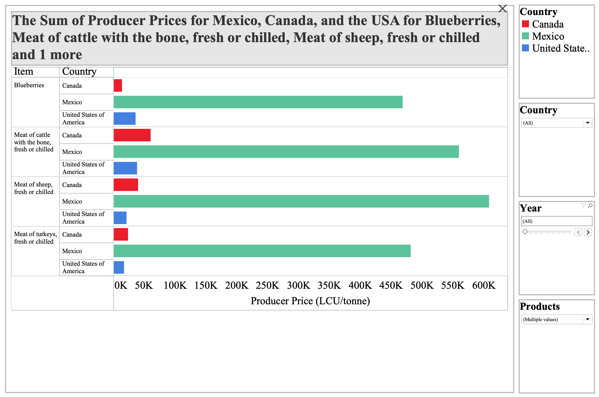
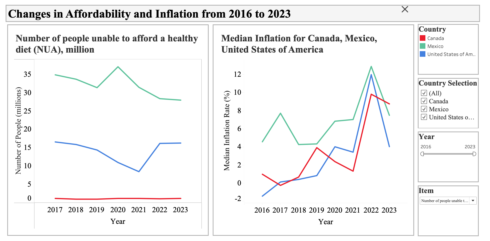

# Food-and-Agriculture-Exploratory-Analysis

## Table of Contents
- [Executive Summary](#Executive-Summary)
- [Project Background](#Project-Background)
- [Methods](#Methods)
- [Trends in Emissions and Changes in Land Temperatures](#Trends-in-Emissions-and-Changes-in-Land-Temperatures)
- [Trend in Total Agricultural Yield](#Trend-In-Total-Agricultural-Yield)
- [Scatterplots Between Key Metrics](#Scatterplots-Between-Key-Metrics)
- [Explanation of Differences in Product Pricing](#Explanation-of-Differences-in-Product-Pricing)
- [Trends in Inflation and Affordability](#Trends-in-Inflation-and-Affordability)
- [Acknowledgements](#Acknowledgements)

## Executive Summary
This report provides an exploratory analysis of greenhouse emissions, land temperatures, agricultural yields, producer pricing, and food affordability. The objective of this report is to highlight trends representative of the environmental and economic environment of Mexico, Canada, and the United States between 2016 and 2023.

This report incorporates data from FAOSTAT and utilizes Excel, MySQL, and Tableau for data cleaning, filtering, and visualization. The accompanying Tableau dashboards provide an interactive interface allowing for country-level and source-level comparisons across all metrics.

### Key Findings

* **Land Temperatures:** Changes in land temperatures have seen a stark increase and are expected to continue rising for Canada and Mexico. Currently, the increase for Canada is approximately 1 °C higher than that of the United States and Mexico.
* **Total Emissions:** The United States had the highest median emissions - approximately 400 kt higher than that of Canada and Mexico. U.S. emissions fell to 38% of their value from 2021 by 2023. Emissions for Canada have shown a recent rise, while those of Mexico have diminished slightly.
* **Emission Intensity:** Emission intensity is on a slight decline, but has remained relatively stable. The exception to this trend is, "Cereals excluding rise", which had a 75% dropoff in value.
* **Agricultural Yields:** There is minimally observed variance in the agricultural yield, though some sources (e.g. green corn, potatoes) have shown gradual increases.
* **Producer Prices:** Producer prices of Mexico heavily outweigh those of the United States and Canada for almost all agricultural products. Green coffee from the United States is the exception, with a producer price approximately 36,000 SLC units higher than that of Mexico.
* **Affordability of a Healthy Diet:** Affordability has declined for Mexico and the United States; Canada experienced minimal increases.
*  **Inflation in Food Pricing:** Inflation experienced steaady growth through 2022, then decreased for all three countries. Canada had the smallest decline in inflation (10%), while the United States had the highest (66.39%).
  
Overall, the analysis performed did not demonstrate a sensitivity between rising emissions and increases in temperatures to changes in agricultural yield. The costs of food and producer pricing have increased, but these are likely a result of influence from economic policies and market conditions rather than environmental factors.

## Project Background
This project used data from the Food and Agriculture Organization of the United Nations's publically available datasets, which provide standardized economic data and agricultural/environmental indicators. This project focuses specifically on data for Canada, Mexico, and the United States. The project made use of Excel, Tableau, Python, and MySQL to prepare and visualize the provided data.

## Methods
The FAOSTAT datasets contained an insignificant amount of missing data and no meaningful outliers. The units used are dependent on the indicator (e.g. the data for yields was filtered for the unit kg/ha). Only standardized currency values were used for financial indicators.

Missing values were found exclusively for yields dataset. The goal was to find products produced by all three countries from 2016 to 2023. Not all products were produced by each country, and products produced by each country were occasionally missing values. In order to solve this issue, a common table expression was used to count the instances in which a product was mentioned for each year (8 total); since there are only three countries, in order for a product to be considered, a total of 24 entries was required. This method removed products with missing data and/or were not produced by all countries. 

MySQL was used to both group values based on Country and Year and join relevant tables. Python was then used to create scatterplots using Pandas and Matplotlib.

To avoid issues with extensive run-time, extraneous markers and codes (such as added notes to each data point) were either removed using Excel, or excluded in SQL queries. 

Global filters for Country and Year range were created using Tableau and applied to all relevant individual sheets. Affordability indicators used different units to measure each quantity; as such, a calculated Field was created to dynamically change the unit being displayed on the y-axis on the Dashboard titled *Affordability and Inflation*. For granular datasets providing monthly reports, Tableau was used to aggregate values to yearly medians.

## Trends in Emissions and Changes in Land Temperatures

*The overall emission, emission intensity, and temperature growth for Mexico, Canada, and the United States. Temperature growth and total emissions are on a rising trend; emission intensity shows gradual decrease. Data taken from FAOSTAT.*

*Tableau Link: https://public.tableau.com/views/ProducerPrices_17637672946740/producerpricesdash?:language=en-US&:sid=&:redirect=auth&:display_count=n&:origin=viz_share_link*

From 2016 to 2021, land temperatures across all three countries experienced substantial fluctutations. Between 2016 to 2019, the median change in temperature was reduced for each country. From 2019 to 2023, Mexico experienced a gradual ascent in temperature, while Canada more than tripled its median change in temperature (234.20%). The United States- which had the highest median value- declined in temperature growth to a value 73.40% that of its value in 2016.

The United States was the highest contributor for all emissions from 2016 to 2023. Although emissions rose during 2016 to 2017 and 2019 to 2020, by 2023, total emissions were only 8% higher than those of 2016. Mexico, which had the lowest emissions, saw an average rise of 31.73 kt per year from 2018 to 2020, followed by a decline to a value 88.62% that of 2016. Canada's emissions mirrored its temperature growth trends: sharp growths from 2020 to 2021 and 2022 to 2023, ultimately culminating in a 178.44% increment over the study period.

Emission intensity has remained on a gradual long-term decrease, with less than 10% year on year variations in intensity. Only, "rice" and "cereals excluding rice" were the exceptions, with the latter dropping to 24.23% of its intensity measure in 2021 by 2023 (for Canada).

The performed analysis indicates a continued pressure for land temperatures to increase despite reductions in emissions. This project does not include the emissions of other countries with emissions similar to, or higher than the countries included in this study. According to the European Union's Emissions Database for Global Atmospheric Research, China was responsible for approximately 30% of greenhouse emissions in 2023, India was responsible for about 8% and Russia 5% of global greenhouse emissions. In more comprehensive studies, these contributions to emissions in the atmosphere must be taken into account to obtain an accurate understanding of the relationship between greenhouse gases and the growth in land temperatures.

## Trend in Total Agricultural Yield

*The total yield across all sources for Mexico, Canada, and the United States. Displayed in the graph are the overall yields for each country from 2016 to 2023. Data taken from FAOSTAT.*

*Tableau Link: https://public.tableau.com/views/YieldsDash/yields?:language=en-US&:sid=&:redirect=auth&:display_count=n&:origin=viz_share_link*

Agricultural yield has remained at consistent levels despite growth in changes in land temperature and total emissions. Yields displayed a minimal correlationa with total emissions and rising land temperatures. The behavior of each of the mentioned quantities is likely to be a sum of other factors not included or portrayed by the data being used, such as better soil quality, or advancements in irrigation, farming practices, and technology.

The NASA article, "*Rising Carbon Dioxide Levels Will Help and Hurt Crops*" explores how the increases in the concentration of Carbon Dioxide in the atmosphere can have the effect of mitigating yield losses while also having greater water use efficiency through higher rates in photosynthesis under certain conditions; this effect, however, does not overshadow any negative effects caused by excessive Carbon Dioxide emissions.

## Scatterplots Between Key Metrics

### Total Emissions vs Changes in Temperatures

*A scatterplot comparing average total emissions and average changes in temperature. Data for each point was connected by country and by year.*

When attempting to identify trends in the comparison between emissions and changes in temperature, it becomes evident that regardless of the amount of emissions, changes in temperature will continue to occur and reach the same temperature change values. This trend gives credit to the idea that emissions and changes in temperature have some correlation, but having higher emissions does not necessarily mean that the temperature will change at higher rates.

### 

## Explanation of Differences in Product Pricing

*Sample producer prices for Mexico, Canada, and the United States. Shown in the image above are four different products produced by all three countries and their respective sum of product pricing for all measured years. Data taken from FAOSTAT.*

*Tableau Link: https://public.tableau.com/views/ProducerPrices_17637672946740/producerpricesdash?:language=en-US&:sid=&:redirect=auth&:display_count=n&:origin=viz_share_link*

Producer pricing has increased for all products for each country, with none of the listed products showing any decreases in price. Standardized product prices for México exceed those of Canada and the United States. This result is likely due to a variety of factors: 

* Mexico imports materials like fertilizers and pesticides, both of which have a high cost because of the war between Russia and Ukraine.
* Disruptions in the supply chain caused by COVID-19 impacted the cost of products (an issue that has also affected the US and Canada).
*  Mexican producers often receive higher prices because of export demand and high labor costs.
*  In a few regions, producers report extortion from organized crime groups, adding to operational costs.

## Trends in Affordability and Inflation

*The Changes in Affordability and Inflation for Mexico, Canada, and the United States. Shown with changes in inflation is the prevalence of the affordability of a healthy diet. Recently, inflation underwent drastic drops, while a healthy diet is less affordable. Data taken from FAOSTAT. Only data from 2017 to 2023 was available for metrics relating to affordability.*

*Tableau Link: https://public.tableau.com/views/AffordabilityandInflation/affordabilityandinflation?:language=en-US&:sid=&:redirect=auth&:display_count=n&:origin=viz_share_link*

Four different measurements were used to determine the affordability of a healthy diet: affordability based on the local currency, based on the purchasing power of an individual, the prevalence of unaffordability, and a count for the number of people incapable of affording a healthy diet. Across all metrics, Mexico had the highest costs of a healthy diet and the highest rates of individuals unable to afford a healthy diet, reaching a peak of about 37.10 million people in 2020, or approximately 30% of the population. Further review reveals that all countries show continuing trends of price increases of a healthy diet. Canada and the United States show marginal increments (1.10 M to 1.20 M and 16.20 M to 16.30 M, respectively) in the amount of people incapable of affording a healthy diet. Mexico has reduced the amount of people incapable of affording a healthy diet by about 9 million.

Inflation rates grew from 2016 to 2022, at which point the inflation rate surged to its highest recorded local maxima. After 2022, inflation was reduced by 66.39% for the United States, 41.89% for Mexico, and 10.90% for Canada. According to Mark Zandi of Moody Analytics, the rise in inflation for the mentioned countries is in part a result of the Russia-Ukraine war, which caused a spike in the price of commodities and oil, leading to higher gas prices and by extension, transport costs for consumer goods.

## Results
Agricultural yields demonstrated no susceptibility to the effects of changes in land temperature growth and the effects of emissions. A proper diet is continuing to become less affordable, but more people can afford it. Inflation has stopped increasing after reaching its maximum in 2022, and is likely to continue on a downwards trend. The affordability of a healthy diet, the number of people incapable of affording, and inflation are metrics that are affected by social and political factors, and thus a connection between them and rising temperatures and emissions cannot be asserted.

## Acknowledgements
I would like to thank the Food and Agriculture Organization of the United Nations for their provision of the data that made this project possible.
